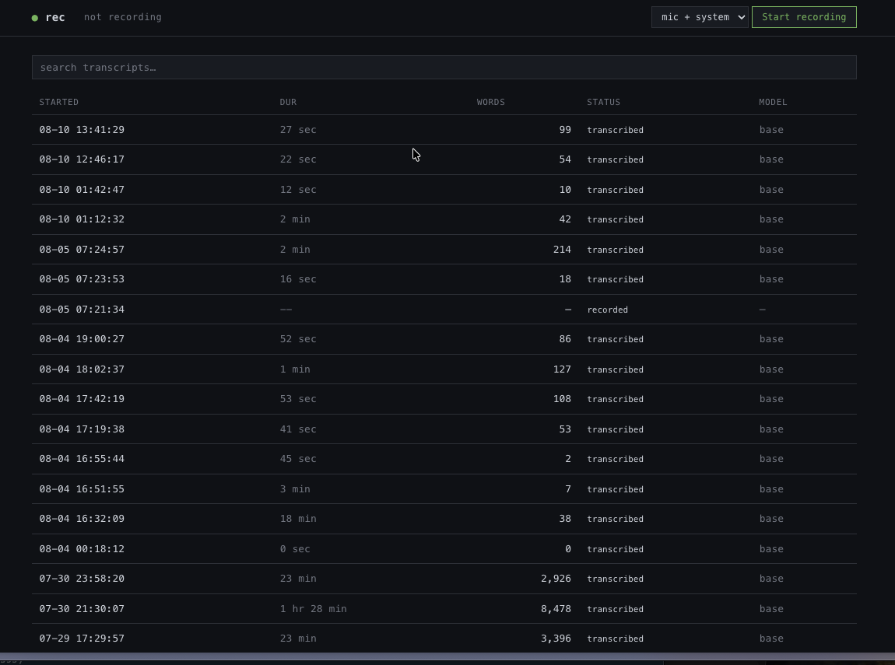
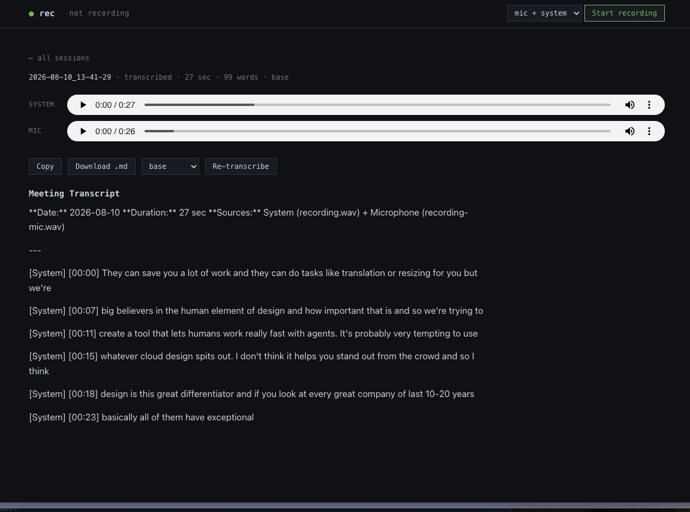

# Call Copilot

> One thing. Done really well. Record meetings. Save transcripts. Don't break audio.

<!-- mcp-name: io.github.anisurrahmann/call-copilot -->

Call Copilot is a terminal command (`rec`) that records your meeting audio and, when you
stop it, transcribes locally and saves a clean markdown transcript. **Everything runs on
your machine** — no cloud, no API keys, no account. Audio and transcripts never leave the
computer.


```
$ rec setup         # one-time: verify macOS + grant capture permission
$ rec start         # starts recording, you keep working
$ rec stop          # stops, transcribes, saves markdown
$ rec list          # shows past recordings
```

## How it captures audio (no BlackHole, no Multi-Output Device)

By default, `rec` captures **both the microphone (your voice) AND system audio (other
participants / anything apps play)** — so a real meeting where *you* speak gets recorded,
not just the audio coming out of your speakers. Both sources are tapped directly via
Apple's Core Audio taps API (macOS 14.2+) using the [`audiotap`](https://pypi.org/project/audiotap/)
library. There is:

- **no virtual audio driver** to install (no BlackHole),
- **no Multi-Output Device** to create in Audio MIDI Setup,
- **no system output device** to switch and restore,
- and therefore **no silent-recording failure** that the old driver-based approaches
  produce when routing breaks.

The mic and system streams are recorded as **two separate WAVs** (each at its own true
rate), transcribed separately, and merged into one transcript with `[Mic]` / `[System]`
labels so you can tell who said what. Want just one source? `rec start --mic-only` or
`--system-only`.

### Grant capture permission (one-time, per terminal app)

macOS ties capture permission to the app you run `rec` from (Terminal, iTerm, **Warp**,
VS Code, …). You need **two** grants:

1. **Microphone** (your voice): System Settings → Privacy & Security → **Microphone** →
   enable your terminal app.
2. **System audio** (grouped under Screen Recording on macOS 14.2+): System Settings →
   Privacy & Security → **Screen Recording** → enable your terminal app, then **quit and
   reopen it** (required for the change to take effect).

Until mic is granted, `rec start` records system audio only and skips the mic (it tells
you so). `rec setup` checks the current mic-permission status.

After `rec stop` (or Ctrl+C from `rec start`), the recording(s) are transcribed locally
with [faster-whisper](https://github.com/SYSTRAN/faster-whisper) (CPU, int8 — no API, no
data leaves your machine) and written to a markdown transcript.

```
recording.wav ──> faster-whisper (local, free) ──> transcript.md
```

## Requirements

- **macOS 14.2 or later** (Sonoma — the Core Audio process taps API `rec` records through
  landed in 14.2). Apple Silicon recommended. Intel works.
- **Python 3.11+** only needed for the `pipx` install; the Homebrew formula brings its own.

No virtual audio driver (no BlackHole), no Multi-Output Device, no manual Audio MIDI Setup.
The tap reads system output directly. `rec` checks the macOS version itself and refuses to
run below 14.2 with a one-line message — you don't have to guess.

## Install

**Homebrew** (recommended — no Python to manage):

```bash
brew install AnisurRahmann/tap/call-copilot
```

**pipx** (if you prefer a plain Python install, no Homebrew):

```bash
pipx install call-copilot
```

Either way you get a `rec` command on your `PATH`. Then jump to
[One-time setup](#one-time-setup).

> Using `rec` on a machine below macOS 14.2 prints `Error: rec requires macOS 14.2 or
> later ...` and exits — no traceback, no mystery. See
> [docs/HOMEBREW.md](docs/HOMEBREW.md) if you're setting up the tap yourself.

## Recording consent & privacy

Call Copilot records audio from your meetings, which may include **other participants**.
Recording laws vary by jurisdiction and many require the consent of everyone being
recorded (one-party vs. all-party consent). **Obtaining that consent is your
responsibility** — check your local laws and your organization's policy before recording.

On the technical side, your data stays put:

- Transcription runs **100% locally** with faster-whisper (CPU, int8) — no API, no cloud.
- **Audio and transcripts never leave your machine.** The only network access is the
  first run of a given Whisper model, which downloads its weights from Hugging Face;
  after that it's fully offline.
- Recordings live under `~/.local/share/rec/sessions/` (XDG data home), outside any repo.

## One-time setup

```bash
rec setup
```

Verifies your macOS version, that the `audiotap` library + its bundled dylib load, saves
your config, and tells you about the one-time capture permission prompt.

## Recording a meeting

```bash
rec start                          # mic + system (default); Ctrl+C to stop & transcribe
rec start --system-only            # just what apps play (not your voice)
rec start --mic-only               # just your voice (not system audio)
rec list                           # browse past sessions
rec transcribe 2026-07-27_14-30-00 --model medium    # re-transcribe at higher quality
rec diagnose 2026-07-27_14-30-00                      # bundle debug info for an AI agent
```

By default `rec start` records **both** your microphone and system audio; the transcript
labels each line `[Mic]` or `[System]`. Use `--system-only` / `--mic-only` to narrow.

**`rec start`** shows a live indicator while recording:

```
● REC  2026-07-28_14-30-00
elapsed 03:47   size 18.2 MB
press Ctrl+C to stop & transcribe
```

Press **Ctrl+C** when your meeting ends — it stops the recording and transcribes in the
same command, then prints the transcript path. One command, start to finish.

Want the old background behavior instead? `rec start --detach` spawns the recorder and
exits immediately; stop it later from another terminal with `rec stop` (or check progress
with `rec status`).

> **Tip:** if a transcript comes back empty, the recording was silent — nothing was
> playing, or the capture permission was revoked. `rec start` (and `rec stop`) warn you
> about this immediately, and `rec diagnose <session>` bundles the audio levels + logs.

## Use your meetings from Claude Code

`rec` ships an **MCP server** (the open protocol Claude Code, Cursor, Zed, Cline, and
other AI tools speak). Point any MCP client at your locally-recorded transcripts and ask
questions about them — answers come back with the **session id cited**, so you can check
the exact moment. Nothing leaves your machine: the server is strictly read-only and makes
no network calls.

```bash
rec mcp install     # writes the server entry into Claude Code's config
```

Then restart Claude Code and ask, for example:

- *"What did the client actually ask for on Tuesday's call?"* — it searches the transcripts,
  finds the line, and cites the session id (e.g. `2026-07-28_12-25-20`) with a timestamp.
- *"List my meetings from last week with their durations."* — it lists sessions, narrowing
  by date.
- *"Show me the full transcript of the standup where we discussed the API migration."* — it
  finds the session, then reads the whole transcript.

Three tools are exposed: `list_sessions` (find a meeting by date), `get_session` (read a
whole transcript), and `search_transcripts` (find specific lines across long transcripts —
pass it **keywords** like `pricing discount`, not a full sentence). The search index lives
at `~/.local/share/rec/index.db`; it builds lazily on first search and is a disposable cache
— `rec index` refreshes it, `rec index --rebuild` recreates it from scratch.

### Other MCP clients (Cursor, Zed, Cline, …)

`rec mcp install` prints a config block that works in any MCP client. For Cursor, paste it
into `.cursor/mcp.json`; for Zed, into `settings.json` under `mcp_servers`. It looks like:

```json
{
  "call-copilot": {
    "type": "stdio",
    "command": "rec",
    "args": ["mcp"]
  }
}
```

You can also run the server directly with `rec mcp` (stdio transport) if a client prefers a
raw command.

### Official MCP Registry

Call Copilot is listed on the [official MCP Registry](https://registry.modelcontextprotocol.io)
under `io.github.anisurrahmann/call-copilot`. Any MCP client that speaks the registry can
discover and add it from there. The registry entry runs the server with:

```bash
uvx --from call-copilot rec mcp
```

(The PyPI package is `call-copilot`; the command it installs is `rec`, so the server is
launched as `rec mcp`.)

## Browser UI

`rec web` opens a local browser tab — a read-mostly viewer for sessions you've
already recorded, plus Start/Stop controls. It's modelled on the qBittorrent /
Transmission web UI: a loopback HTTP server serves a single-page app that drives
the **same** session store the CLI uses. The terminal can't show a live capture
meter, a seekable audio player beside its transcript, or a session list you can
skim in one glance — the browser can, so the UI exists for exactly those three
things.





```bash
rec setup            # one-time, in a terminal (the UI can't grant capture permission)
rec web              # opens a browser tab at http://127.0.0.1:7717
```

From the tab you can browse sessions, play and seek the audio next to its
transcript, search across every transcript, and Start/Stop a recording. Start
calls the same recorder the CLI does; Stop queues transcription and the page
polls until the transcript is ready. If no config is found, the Start button
tells you to run `rec setup` in a terminal first.

The server binds to `127.0.0.1` only — the host is not configurable, by design
(a local tool must not become an open transcript server). `--port` overrides the
default port; `--no-open` skips the automatic browser tab.

> **What this is not.** The UI is still **not** a real-time transcription
> surface — the transcript arrives after Stop, exactly as in the CLI, and there
> is still no cloud, no sync, and no account. Every action in the browser maps
> to a command that already exists; if a feature has no CLI equivalent, it is
> not in the UI.

## Configuration

Stored at `~/.config/rec/config.json` (XDG). Recordings live under
`~/.local/share/rec/sessions/{id}/`. Override the XDG roots with `XDG_CONFIG_HOME` /
`XDG_DATA_HOME` if needed.

```json
{
  "sample_rate": 16000,
  "channels": 1,
  "whisper_model": "base",
  "capture": "system",
  "sessions_dir": "~/.local/share/rec/sessions"
}
```

16 kHz mono float32 is Whisper's native input format — no resampling, smallest files
(~7.5 MB/min), best transcription accuracy.

### A note on sample rate (why your recordings play at the right speed)

`audiotap`'s `sample_rate` parameter is **not honored** — the tap always delivers
audio at your output device's native rate (typically 48 kHz), regardless of what
we request. `rec` handles this transparently: the recorder **measures the true
capture rate** when the tap starts and writes the WAV at that rate (so playback
is the correct speed), and the transcriber **resamples to 16 kHz** before
feeding Whisper (so transcription is accurate). You don't need to do anything;
this section exists to explain the `capture_sample_rate` field in `session.json`
(which may differ from the `sample_rate` in your config).

### A note on VAD (voice activity detection)

Transcription runs **without** faster-whisper's Silero VAD pre-filter by default.
The VAD is tuned for close-mic speech and aggressively rejects system-audio
capture (speakers/headphones via a tap, which has a different character) — we've
seen it discard 100% of a clearly-audible recording and return an empty
transcript. Whisper's own `no_speech_threshold` handles silence adequately
without that risk.

If you have clean close-mic input and want long silences skipped (faster,
cleaner output), enable it per run:

```bash
rec stop --vad              # VAD on for this transcription
rec transcribe <id> --vad   # re-transcribe with VAD
```

## Stack

| Tool | Role |
|------|------|
| [`audiotap`](https://github.com/graphaelli/audiotap) | Core Audio taps → captures system audio directly (macOS 14.2+) |
| [`soundfile`](https://github.com/bastibe/python-soundfile) | Streams WAV chunks to disk (constant memory) |
| [`faster-whisper`](https://github.com/SYSTRAN/faster-whisper) | Local speech-to-text (CPU int8) |
| [`rich`](https://github.com/Textualize/rich) + [`click`](https://click.palletsprojects.com/) | Terminal UI + CLI |

Everything is free and open-source. Transcription runs 100% locally — no API cost, no
data leaves the machine. (The first run of a given whisper model downloads its weights
from Hugging Face; after that it's offline.)

## Logging & debugging

Every activity — the audio tap lifecycle, chunk writes, transcription, formatting, each
CLI decision — is logged. Logs flow to three destinations:

| Destination | Path | Level | What it's for |
|---|---|---|---|
| **Console (stderr)** | your terminal | WARNING* | User-facing; clean by default |
| **Global log** | `~/.local/share/rec/logs/rec.log` | DEBUG | Monitor surface — `tail -f` it |
| **Session log** | `~/.local/share/rec/sessions/<id>/recorder.log` | DEBUG | Per-session post-mortem |

\* WARNING by default: `-v` → INFO, `-vv` → DEBUG, `--quiet` → CRITICAL, `REC_LOG_LEVEL=DEBUG`.

Every command failure is logged at `ERROR` with the reason + exit code; unexpected
crashes include the full traceback.

### Hand a session to an AI agent to debug

```bash
rec list                                 # find the session id
rec diagnose 2026-07-27_14-30-00        # → writes sessions/<id>/diagnose.md
rec diagnose 2026-07-27_14-30-00 --stdout | <your-ai-tool>   # pipe straight to an agent
```

The bundle contains the session metadata, the daemon's `recorder.log`, the global-log
lines tagged with that session, the transcript if it exists, and the config — followed
by a debugging checklist. (`rec diagnose` accepts a unique prefix too, e.g. `2026-07-27`.)

> **Note on the recording loop:** the audio callback runs on Core Audio's real-time
> thread and deliberately logs nothing — it copies each chunk to a queue and a writer
> thread does the disk I/O. The daemon logs only at tap start/stop and on signals.

## Development

You only need this if you're hacking on `rec` itself. End users should use the
[Install](#install) commands above.

```bash
git clone https://github.com/AnisurRahmann/call-copilot.git && cd call-copilot
make install          # creates .venv and installs `rec` in editable mode + dev deps
make test             # unit tests (offline — no audio device or model download needed)
make run              # rec start, using the dev venv's rec
```

`make install` requires Python 3.11+ on your `PATH` (it pins `python3.11` for the
venv). For everything else — releasing, the Homebrew tap, code style — see
[CONTRIBUTING.md](CONTRIBUTING.md) and [docs/HOMEBREW.md](docs/HOMEBREW.md).

## Contributing

Issues and pull requests are welcome at
[github.com/AnisurRahmann/call-copilot](https://github.com/AnisurRahmann/call-copilot).
Please read [CONTRIBUTING.md](CONTRIBUTING.md) before opening a PR, and report security
issues privately per [SECURITY.md](SECURITY.md).

## What this is NOT

- Not a real-time transcription tool (transcription happens after you stop).
- Not a meeting summarizer (just the transcript).
- Not a Zoom/Meet plugin (it captures system audio generically).
- Not cross-platform (macOS 14.2+ only).

## License

MIT — see [LICENSE](LICENSE). © Anisur Rahman.
